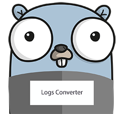

<p align="center"></p>
<p align="center">
 <a href="https://travis-ci.org/oleg-balunenko/logs-converter"></img></a>
    <a href="https://goreportcard.com/report/github.com/oleg-balunenko/logs-converter"></img></a>
   <a href="https://coveralls.io/github/oleg-balunenko/logs-converter?branch=master"></img></a>
   <a href="https://sonarcloud.io/dashboard?id=logs-converter"></img></a>
   <a href="https://github.com/oleg-balunenko/logs-converter/releases/latest"></img></a>
</p>

# logs-converter

The converter will parse files with different log formats and according
on their basis insert MongoDB documents with a monotonous structure.

## How to run it

1. Install Mongo (oficial installation guides: <https://docs.mongodb.com/manual/installation/)>
2. Run mongo

    ```bash
      mongod
    ```

3. Update `config.toml` file in the root of repository with actual parameters and save it (see Configuration)
4. a) - From root of repository run

    ```bash
      go build
    ```
    b) Download latest artifacts [](https://github.com/oleg-balunenko/logs-converter/releases/latest)

5. Run tool

    ```bash
      .logs-converter
    ```

## Configuration

Tool could be configured in 3 ways:
*run with flags
*config file
*einvironment variables

### Flags

```text
  -dropdb
        if true - will drop whole collection before starting to store all logs (default true)
  -loglevel
        LogLevel level: All, Debug, Info, Error, Fatal, Panic, Warn (default Debug)
  -logsfileslist
         (default map[])
  -logsfileslistjson
        JSON with list of all files that need to be looked at and converted
                                                example of JSON:
                                                        {
                                                                "/log1.txt":"first_format",
                                                                "/dir/log2.log":"second_format",
                                                                "/dir2/log3.txt":"first_format"
                                                        }
                                 (default {"testdata/testfile1.log":"second_format","testdata/dir1/testfile2.log":"first_format"})
  -mongocollection
        Mongo DB collection (default logs)
  -mongodb
        Mongo DB name (default myDB)
  -mongopassword
        MongoDB Password
  -mongourl
        Mongo URL (default localhost:27017)
  -mongousername
        MongoDB Username
```

### TOML`config.toml` update following parameters to what you need

***LogLevel** - stdout log level: All, Debug, Info, Error, Fatal, Panic, Warn (default Debug)
***LogsFilesListJSON** - JSON with list of all files that need to be looked at and converted
***DBURL** - DB URL (default localhost:27017)
***DBName** - DB name (default myDB)
***MongoCollection** - Mongo DB collection (default logs)
***DBUsername** - Mongo DB Username
***DBPassword** - Mongo DB password
***DropDB** - if true - will drop whole collection before starting to store all logs
***FilesMustExist*** - if true - will throw error when file is not exist; when false - wait for file create
***FollowFiles*** - if true - will tail file and wait for updates; when false - end file reading after EOF

example of `config.toml`:

```toml
LogLevel="Debug"
LogsFilesListJSON='{"testdata/testfile1.log":"second_format","testdata/dir1/testfile2.log":"first_format"}'
DBURL="localhost:27017"
DBName="myDB"
MongoCollection="logs"
DBUsername=""
DBPassword=""
DropDB=true
FilesMustExist=true
FollowFiles=true
```

### environment variables

export following environment variables with your values

example:

```bash

	export LOGSCONVERTER_DB_NAME="myDB"
	export LOGSCONVERTER_DB_PASSWORD=""
    export LOGSCONVERTER_DBURL="localhost:27017"
    export LOGSCONVERTER_DB_USERNAME=""
    export LOGSCONVERTER_DROP_DB=false
    export LOGSCONVERTER_FILES_MUST_EXIST=false
    export LOGSCONVERTER_FOLLOW_FILES=true
    export LOGSCONVERTER_LOG_LEVEL="Info"
    export LOGSCONVERTER_LOGS_FILES_LIST_JSON='{"testdata/testfile1.log":"second_format","testdata/dir1/testfile2.log":"first_format"}'
    export LOGSCONVERTER_MONGO_COLLECTION="logs"  
    
```
